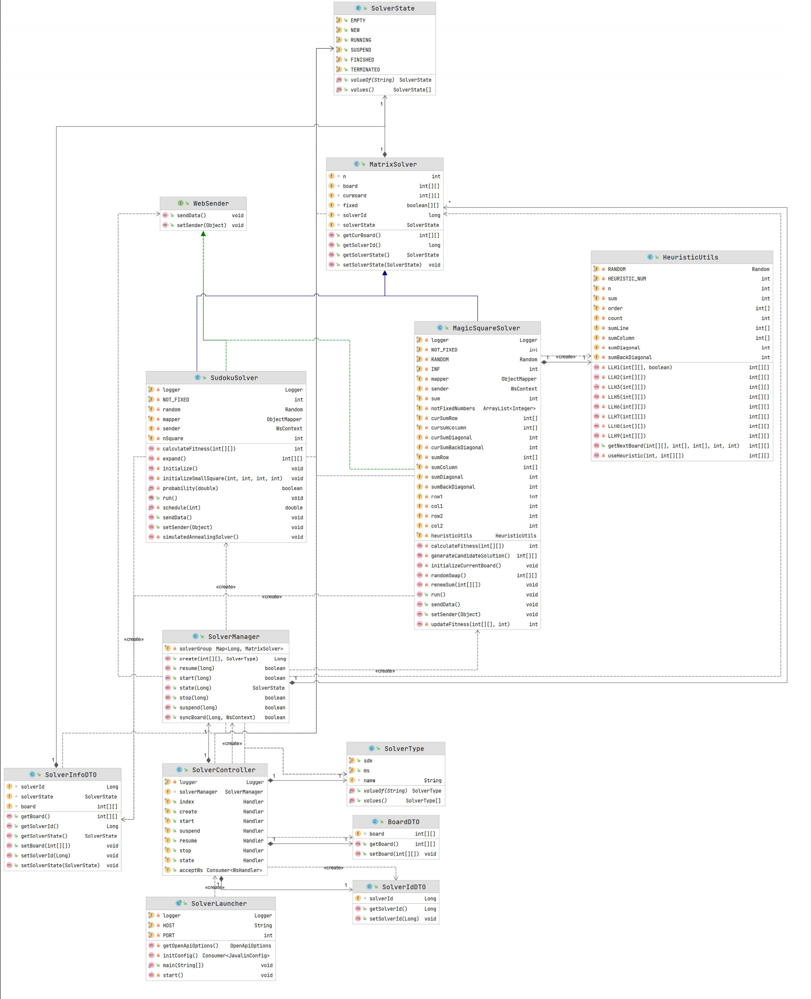
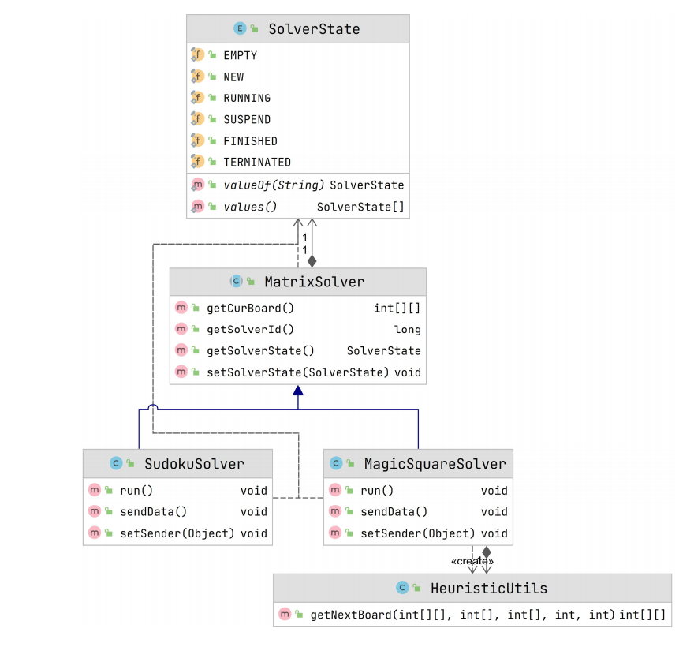
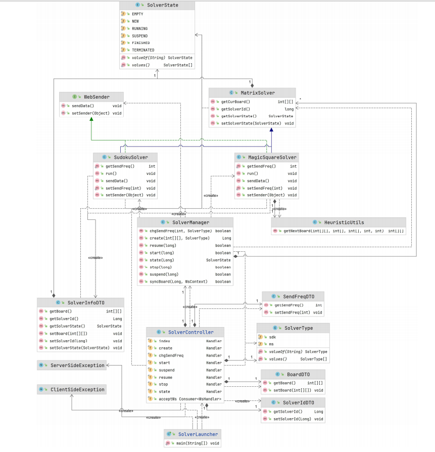

# Design Document of the Back End

[中文简体](./design_document_back_end-zh-cn.md)

The project is a front-end and back-end separation project, the transmission protocol are **HTTP** and **WebSocket**, and the API interface design follows the **RESTful** theory specification.

The back-end is divided into **core** module and **web** module, and the programming language used is **Java**.

<br>

## 1. Structure

#### Directory tree

```shell
├─main
│  ├─java
│  │  ├─core
│  │  │  ├─model
│  │  │  │  ├─SolverState.java
│  │  │  │  └─SolverType.java
│  │  │  └─solver
│  │  │     ├─MatrixSolver.java
│  │  │     ├─SudokuSolver.java
│  │  │     ├─MagicSquareSolver.java
│  │  │     └─HeuristicUtils.java
│  │  └─web
│  │     ├─exception
│  │     │  ├─ClientSideException.java
│  │     │  └─ServerSideException.java
│  │     ├─model
│  │     │  ├─BoardDTO.java
│  │     │  ├─SolverIdDTO.java
│  │     │  ├─SolverInfoDTO.java
│  │     │  └─WebSender.java
│  │     ├─solver
│  │     │  ├─SolverController.java
│  │     │  └─SolverManager.java
│  │     └─SolverLauncher
│  └─resources
└─test
    └─java
       └─MagicSquareSolverTest.java
```

<br>

#### UML

UML pdf file: [CLICK ME](UML.pdf)



<br>

## 2. Core Module

The core module provides matrix puzzle solvers. The current solvers included are: **Sudoku Solver** and **Magic Square Solver**.

The simple UML diagram of the core module (contains only public fields and methods) is as follows:



<br>

+ `MatrixSolver` : an abstract class that contains fields such as matrix dimensions and matrix content, solver status, etc.
+ `SudokuSolver` : subclass of `MatrixSolver`, which perform the tasks of solving Sudoku.
+ `MagicSquareSolver` : subclass of `MatrixSolver`, which perform the tasks of solving Magic Squares.
+ `HeuristicUtils` : a tool class of heuristic algorithms for solving matrix puzzles.
+ `SolverType` : solver type enumeration class, currently includes Sudoku and Magic Square.
+ `SolverState` : an enumeration class that contains the state of the solver.
  - *EMPTY* : The solver did not solve the task
  - *NEW* : The solver has been assigned a solution task, but the solving task has not yet started
  - *RUNNING* : The solver is solving the matrix puzzle
  - *SUSPEND* : The solving task is suspended
  - *FINISHED* : The solver has completed the solving task
  - *TERMINATED* : The solving task of the solver has been actively terminated (the solution may not be completed)


## 2. Web Module

The main task of the Web module is to transfer data with the front-end page, accept matrix puzzle solving tasks, and synchronize matrix information and solver status.

The simple UML diagram of the Web module (contains only public fields and methods) is as follows:



<br>

+ `WebSender` : SudokuSolver and MagicSquareSolver achieve the ability to send matrix data to the front-end by implementing the interface `WebSender`.
+ `SolverManager` : manages all the problem solvers in the backend.
  - When a new problem solver is created, a globally unique problem solver ID is generated
  - The solver ID can be used to start, pause, stop the solver, and synchronize matrix data
+ `SolverController` : contains some handlers for handling requests from the front-end, parsing parameters, and synchronizing results.
+ `SolverLauncher` : solver back-end starter, back-end program start entry.
+ `BoardDTO` : data transfer object, used to transfer matrix chessboard data between the front-end and back-end.
+ `SolverIdDTO` : data transfer object, used to transfer solver ID between the front-end and back-end.
+ `SolverInfoDTO` : data transfer object, used to transfer the solver information (including solver ID, solver state, matrix chessboard data) between the front-end and back-end.
+ `ClientSideException` : Client Side Exception Class.
+ `ServerSideException` : Server Side Exception Class.