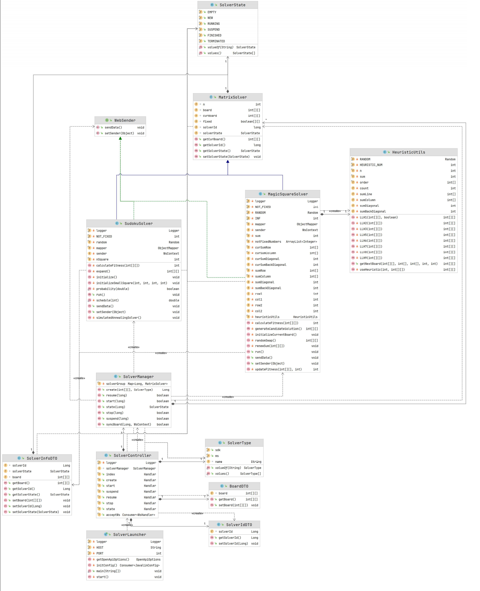
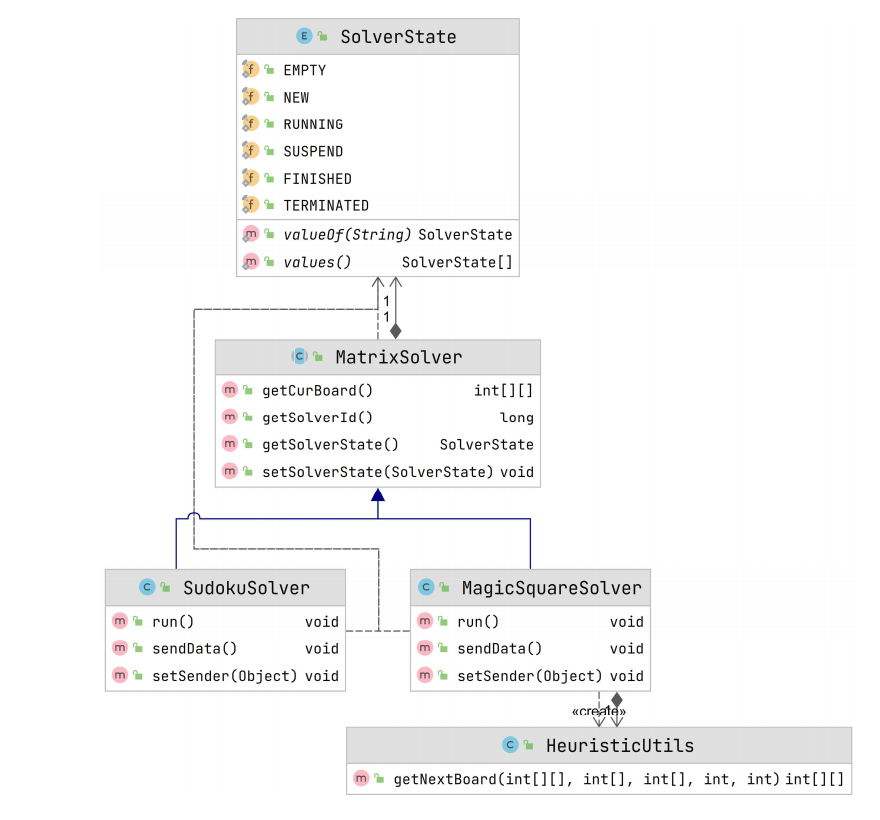

# Design Document of the Back End

[English](./design_document_back_end-en.md)

该项目为前后端分离项目，传输协议为 **HTTP**，API 接口设计遵循 **RESTful** 理论规范。

后端分为 **core** 模块和 **web** 模块，使用的编程语言为 **Java**。

<br>

## 1. 结构

#### 目录树

```shell
├─main
│  ├─java
│  │  ├─core
│  │  │  ├─model
│  │  │  │  ├─SolverState.java
│  │  │  │  └─SolverType.java
│  │  │  └─solver
│  │  │     ├─MatrixSolver.java
│  │  │     ├─SudokuSolver.java
│  │  │     ├─MagicSquareSolver.java
│  │  │     └─HeuristicUtils.java
│  │  └─web
│  │     ├─model
│  │     │  ├─BoardDTO.java
│  │     │  ├─SolverIdDTO.java
│  │     │  ├─SolverInfoDTO.java
│  │     │  └─WebSender.java
│  │     ├─solver
│  │     │  ├─SolverController.java
│  │     │  └─SolverManager.java
│  │     └─SolverLauncher
│  └─resources
└─test
    └─java
       └─MagicSquareSolverTest.java
```

<br>

#### UML
UML pdf 文件: [点击此处](UML.pdf)



<br>

## 2. 核心模块

核心模块提供矩阵难题求解器，目前包含的求解器为：数独求解器、幻方求解器。

核心模块简单的 UML 图（只包含 public 字段和方法）如下：



<br>

+ `MatrixSolver` 抽象类，它包含矩阵维度和矩阵内容、求解器状态等字段。

+ `SudokuSolver`: 矩阵求解器的子类，执行求解数独的任务。
+ `MagicSquareSolver`: 矩阵求解器的子类，执行求解幻方的任务。
+ `HeuristicUtils` 矩阵难题求解启发式算法的工具类。
+ `SolverState` 枚举类，它包含了求解器的状态：
  - EMPTY: 求解器没有求解任务
  - NEW: 求解器被分配求解任务，但是还没开始求解
  - RUNNING: 求解器正在求解矩阵难题
  - SUSPEND: 求解器被暂停
  - FINISHED: 求解器已完成求解任务
  - TERMINATED: 求解器的求解任务已被主动终止（可能未完成求解）

<br>

## 3. Web 模块

Web 模块的主要任务是和前端页面进行数据传输，接受矩阵难题求解任务，同步矩阵信息和求解器状态。

Web 模块简单的 UML 图（只包含 public 字段和方法）如下：


<br>

+ `WebSender`: `SudokuSolver` 和 `MagicSquareSolver` 通过实现 `WebSender` 接口获得发送矩阵数据到前端的能力。
+ `SolverManager`: 管理后端所有的解题器。
  - 创建新的解题器时产生一个全局唯一的解题器 ID
  - 可以通过解题器 ID 启动、暂停、停止解题器，以及同步矩阵数据
+ `SolverController`: 包含一些处理器，用于处理前端发来的请求，解析参数，同步结果。

