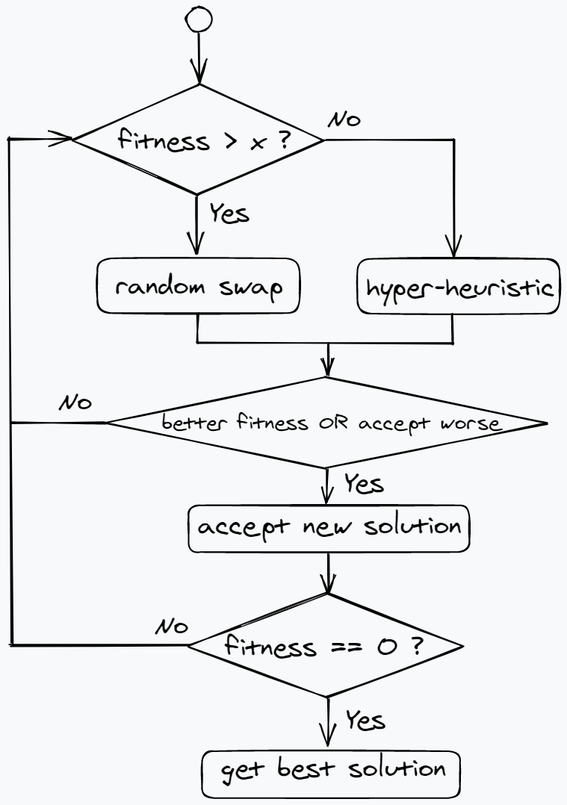

# Design Document of the solvers

## 1 Magic Square solver

I have to say that this is a really exciting part. The main idea is from Ahmed and Ender [1], using hyper-heuristics.

### 1.1 Representations

- `n`: the size of the magic square

- `sum`: magic value, to be specific, the sum of each row, column or diagonal

- `fitness`: value of the objective function, mentioned in the next part

- `threshold`: when the fitness is less than or equal to this value, then the program will change the way it generates solution.

### 1.2 Origin Methodology

In [1], two sets of hyper-heuristic methods are mentioned, one for small squares with `n <= 23`, and another for large squares with `25 <= n <= 2600`. The main requirement of this project is to solve squares of max size 20, so only the first hyper-heuristic method will be talked here.

Selection hyper-heuristic means "the heuristic to choose heuristic". [1] tested 6 kinds of heuristic selection method combining with 6 move acceptance methods and 9 low-level heuristics (LLH). Among them, the combination of **Random Permutation (RP)** and **naive move acceptance** together with the 9 LLH has the best performance.

- **Random Permutation**: generates a permutation of LLH randomly, and applies a LLH in the provided order sequentially.
  
- **naive move acceptance**: accepts worsening solutions with a certain probability. In [1], it is tested that *0.004%* is the best.
  
- **low-level heuristics**: modifies a solution while respecting the given constraint, as there are too many of them, here we only discuss two of them. For the remaining `LLH`, you can look up the origin paper.
    - Select largest sum of row, column or diagonal and
      smallest sum of row, column or diagonal and swap the
      largest element from the first with smallest in the second.
      
    - Swap two entries that fixes the magic number
      violation by trying to select an entry that is not in a row,
      column or diagonal satisfying the magic rule. Then swap
      this entry with another entry to satisfy, hopefully, the
      magic rule for the selected row, column or diagonal.
  
- **Objective function**: the sum of the differences between magic value and the sum of each row, column or diagonal. If the fixed places are modified, the value of objective function's value is **infinity** and will never be accepted.

### 1.3 Our Improvement

Based on the work above, we found the convergence speed is too slow. This is because complicate search is needed when doing heuristics. To make it converge faster, two things are done:

1. Do random swap rather than the heuristics when the fitness is bigger than a certain value `threshold`
    
2. When doing random swap, update the sum of the rows, columns and diagonals they are in. 

This makes a big difference to the performance from about 4 seconds to about **250 milliseconds** for `n = 20`.

The following figure shows the flow of our algorithm:

### 1.4 Performance

We performed our experiments on an `intel i7-10870H CPU @ 2.20 GHz with 16.00 GB memory` and each one is repeated for 30 trials. The result is shown in the table below:

|  n  | average time |
| --- | ------------ |
|  3  |   73 ms |
|  5  |  788 ms |
|  10 |   47 ms |
|  15 |   98 ms |
|  20 |  238 ms |
|  30 | 1324 ms |
|  40 | 3794 ms |

## 2 Sudoku solver

## Reference

[1] *Ahmed Kheiri, Ender Özcan, Constructing Constrained-Version of Magic Squares Using 
Selection Hyper-heuristics, The Computer Journal, Volume 57, Issue 3, March 2014, Pages 469–479, 
https://doi.org/10.1093/comjnl/bxt130*